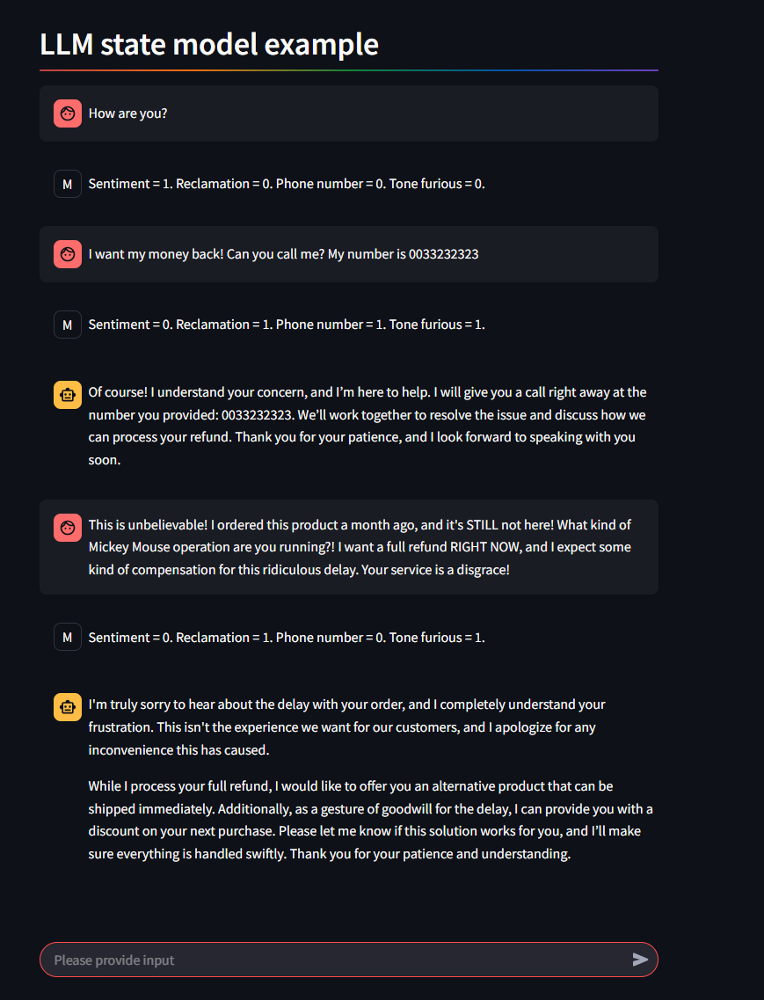

# LLM State Machine




This example demonstrates the creation of basic LLM-driven state machines with two and three states, designed to generate categorical outputs. A validator is also implemented to ensure the correctness of the generated values. This is achieved using agents to build the LLM state machines from scratch, without the use of a dedicated framework.

## Virtual environment

The virtual environment is created using the commands:

```python
python -m venv .env
source .env/bin/activate
pip install -r requirements.txt
```

## Two-State LLM Machine

The two-state LLM Machine agent is defined as

```python
class Agent_Two_State:
	def __init__(self, model="gpt-4o-mini", temperature=0.6, max_tokens=4086, top_p=0.9):
	
		self.client = OpenAI()
		self.model = model
		self.temperature = temperature
		self.max_tokens = max_tokens
		self.top_p = top_p

	def evaluate(self, context, question, answers):
	
		instructions = f"""You are a helpful AI assistant. Use {context} to answer to the question which is given in {question}. If the answer is {answers[0]} return "1". If the asnwer is {answers[1]} return "0". Return only "1" or "0". """
		initial_messages = [{"role": "user", "content": instructions}]

		response = self.client.chat.completions.create(
			model=self.model,
			messages=initial_messages,
			temperature=self.temperature,
			max_tokens=self.max_tokens,
			top_p=self.top_p,
		)
		response_text = response.choices[0].message.content
		return response_text
```

## Three-State LLM Machine

The three-state LLM Machine agent is defined as

```python
class Agent_Three_State:
	def __init__(self, model="gpt-4o", temperature=0.6, max_tokens=4086, top_p=0.9):
	
		self.client = OpenAI()
		self.model = model
		self.temperature = temperature
		self.max_tokens = max_tokens
		self.top_p = top_p

	def evaluate(self, context, question, answers):
	
		instructions = f"""You are a helpful AI assistant. Use {context} to answer to the question which is given in {question}. If the answer is {answers[0]} return "2". If the asnwer is {answers[1]} return "1". If the asnwer is {answers[2]} return "0". Return only "2", "1" or "0". """
		initial_messages = [{"role": "user", "content": instructions}]

		response = self.client.chat.completions.create(
			model=self.model,
			messages=initial_messages,
			temperature=self.temperature,
			max_tokens=self.max_tokens,
			top_p=self.top_p,
		)
		response_text = response.choices[0].message.content
		return response_text
```

